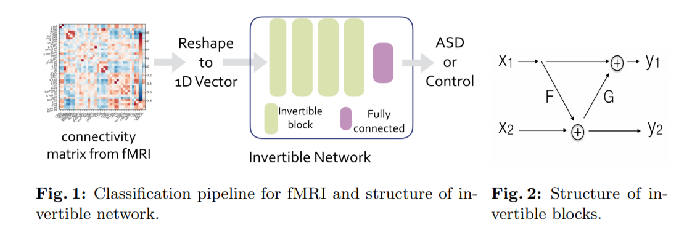
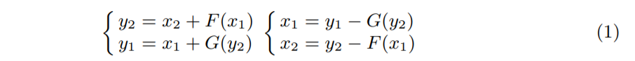
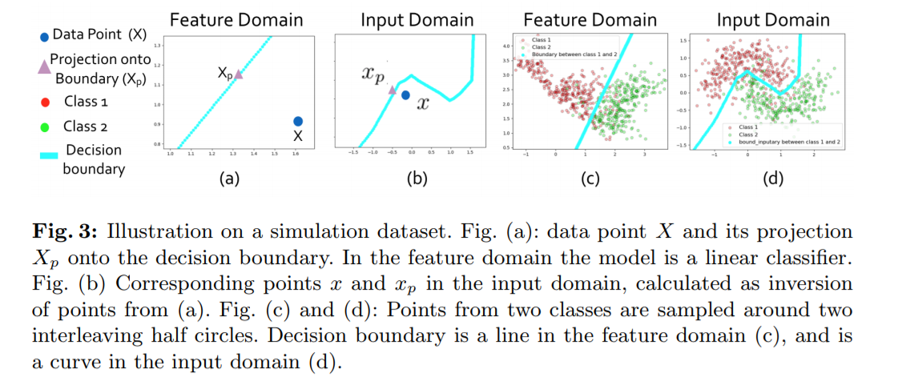

# Introduction
* This repo contains the code to reproduce the results on toy example for the paper [Decision explanation and feature importance for invertible networks] (https://arxiv.org/abs/1910.00406)
* Explicitly determine the decision boundary with an invertible neural network.
* Direct explanation of network decisions
* After determining the decision boundary, we can calculate the projection of a data point onto the decision boundary. <br/>
The difference between and point and its projection onto the boundary can be viewed as the explanation for network decision.

# Requirements
* PyTorch 0.4 or higher
* matplotlib
* tqdm

# How to run
* run ```python train_inverse_net_1d.py``` to train
* run ```python generate_boundary.py``` to generate figures

# Invertible block structure
<br/>

The forward and inverse of an invertible block is: <br/>
 <br/>

# Invertible Network as a 2-stage model
* Transfrom from the input domain to the feature domain ```feature = T(x)``` where ```T``` is an invertible function
* Linear classifier in the feature domain ```\hat{y} = Linear\_Classifier(feature)```
* It's easy to determine the decision boundary for a linear classifier, denoted as ```B```. Since ```T``` is invertible, we can determine the corresponding boundary in the input domain.
* We can explain the decision of a linear classifier as the difference between a point and its projection onto the decision boundary, similarly, we can determine the projection onto boundary in the feature domain, and invert the projection into the input domain.  In this way, we get a similar analysis to linear cases.

# Results 
* We explicitly determine the decision boundary, and the projection of datapoints onto the boundary <br/>

